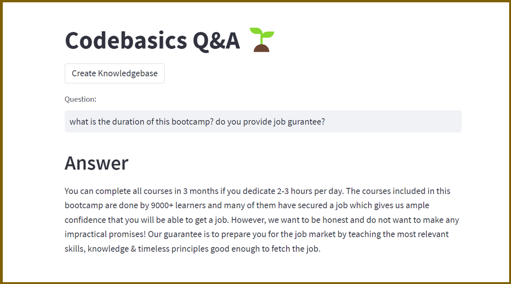

# Codebasics Q&A: Question and Answer System Based on Google Palm LLM and Langchain for E-learning company  

This is an end to end LLM project based on Google Palm and Langchain. We are building a Q&A system for an e-learning company called codebasics (website: codebasics.io). Codebasics sells data related courses and bootcamps. They have thousands of learners who uses discord server or email to ask questions. This system will provide a streamlit based user interface for students where they can ask questions and get answers. 

[YouTube](https://www.youtube.com/watch?v=AjQPRomyd-k&t=303s)



## Project Highlights

- Use a real CSV file of FAQs that Codebasics company is using right now. 
- Their human staff will use this file to assist their course learners.
- We will build an LLM based question and answer system that can reduce the workload of their human staff.
- Students should be able to use this system to ask questions directly and get answers within seconds

## You will learn following,
  - Langchain + Google Palm: LLM based Q&A
  - Streamlit: UI
  - Huggingface instructor embeddings: Text embeddings
  - FAISS: Vector databse

## Installation
0. using WSL

1.Clone this repository to your local machine using:

```bash
  git clone https://github.com/codebasics/langchain.git
  pip install google-generativeai
```
2.Navigate to the project directory:

```bash
  cd 3_project_codebasics_q_and_a
```
3. Install the required dependencies using pip:

```bash
  pip install -r requirements.txt
```
4.Acquire an api key through makersuite.google.com and put it in .env file

```bash
  GOOGLE_API_KEY="your_api_key_here"
```
## Usage

1. Run the Streamlit app by executing:
```bash
streamlit run main.py

```

2.The web app will open in your browser.

- To create a knowledebase of FAQs, click on Create Knolwedge Base button. It will take some time before knowledgebase is created so please wait.

- Once knowledge base is created you will see a directory called faiss_index in your current folder

- Now you are ready to ask questions. Type your question in Question box and hit Enter

## Sample Questions
  - Do you guys provide internship and also do you offer EMI payments?
  - Do you have javascript course?
  - Should I learn power bi or tableau?
  - I've a MAC computer. Can I use powerbi on it?
  - I don't see power pivot. how can I enable it?

## Project Structure

- main.py: The main Streamlit application script.
- langchain_helper.py: This has all the langchain code
- requirements.txt: A list of required Python packages for the project.
- .env: Configuration file for storing your Google API key.

## Google MakerSuite

https://makersuite.google.com


## Issues

### ModuleNotFoundError: No module named 'InstructorEmbedding'

2023-11-26 09:46:41.978 Uncaught app exception
Traceback (most recent call last):
  File "/home/gong/projects/st/lib/python3.9/site-packages/langchain/embeddings/huggingface.py", line 148, in __init__
    from InstructorEmbedding import INSTRUCTOR
ModuleNotFoundError: No module named 'InstructorEmbedding'

The above exception was the direct cause of the following exception:

Traceback (most recent call last):
  File "/home/gong/projects/st/lib/python3.9/site-packages/streamlit/runtime/scriptrunner/script_runner.py", line 565, in _run_script
    exec(code, module.__dict__)
  File "/home/gong/projects/AI/langchain/3_project_codebasics_q_and_a/main.py", line 2, in <module>
    from langchain_helper import get_qa_chain, create_vector_db
  File "/home/gong/projects/AI/langchain/3_project_codebasics_q_and_a/langchain_helper.py", line 20, in <module>
    instructor_embeddings = HuggingFaceInstructEmbeddings(model_name="hkunlp/instructor-large")
  File "/home/gong/projects/st/lib/python3.9/site-packages/langchain/embeddings/huggingface.py", line 154, in __init__
    raise ImportError("Dependencies for InstructorEmbedding not found.") from e
ImportError: Dependencies for InstructorEmbedding not found.

#### Solution: pip install InstructorEmbedding

### venv not working in WSL

https://stackoverflow.com/questions/70519432/python-virtual-env-succesfully-activated-via-wsl-but-not-working

#### Solution:

```
conda deactivate  # get out of base

pip install jupyter

cd ~/projects
source st/bin/activate # enter st

cd ~/projects/AI/langchain/3_project_codebasics_q_and_a

streamlit run main.py

load INSTRUCTOR_Transformer
max_seq_length  512
```

### Data issue
UnicodeDecodeError: 'utf-8' codec can't decode byte 0x92 in position 1203: invalid start byte

CSVLoader on 'codebasics_faqs.csv' failed

because "�" is not invalid unicode, replace it with "'"